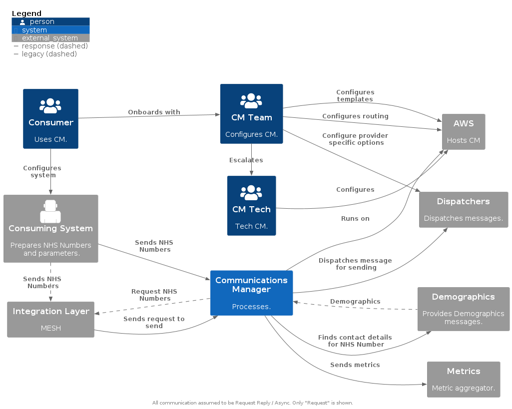

# 1. KAD-CM-032 - Maturing Architecture


## 1.1. Summary
To aid the future development of Communications Manager this outlines guidance for how to approach and mature architectural decisions.

Clarify existing Comms Manager Enterprise Architecture - Core capabilities and requirements, how it interacts with people and external systems

1. Identify Styles, Practises and Patterns suitable for Communications Manager
1. Provide Strategic architectural designs, following the identified styles, practises and patterns
1. Outcomes / Decisions from discussions around Maturing Architecture => Target Architecture 

### 1.1.1. Why?
[At some point](https://ddd.mikaelvesavuori.se/readme/on-design), you won't have technical problems, only design problems relating to poor models, poor decisions, and poor structure.

To help avoid this, all projects require a plan, setting out a target that should be followed.

"Responding to change over following a plan" - this is often quoted back when there is talk of an architectural plan being created. However, this is always mis quoted.

Without having a plan, how can you decide not to follow one?...

This part of the agile manifesto actually aims to convey that you should not blindly follow a plan if it is not working for changes that have been introduced that contradict the plan that you have. Not one member of the original Agile manifesto group considered that people would take this to mean that you don't need a plan in the first place!  

Having a plan does not mean you cannot change direction. Having a plan does not mean that you cannot iterate. 

To be able to react to change, you must have a plan. And to be able to iterate effectively, you need a plan that outlines the goals for what you are iterating towards.

### 1.1.2. Background Research

It has included:

- system context review
- architectural document review,
- infrastructure review and
- code base review

### 1.1.3. Intended Audience

- Architects
- Tech Leads
  
### 1.1.4. Key Takeaways

*Document is not a review of the effectiveness of current Architecture / Tech.*

*Communications Manager has evolved organically since inception. To ensure it is able to evolve and sustain capability for future feature requests and increased demands, it's architecture should to be reviewed and target changes suggested.*


**Architectural Guidance on:**

- Target System Context 
- Styles
  - EDA
  - Better defined Microservices
  - Strategic DDD
- Patterns
  - Tactical DDD
  - API First 
  - Choreography
  - CQRQ
  - EventSourcing
  - Async Request Reply

## 1.2. Table of Contents

- [1. KAD-CM-032 - Maturing Architecture](#1-kad-cm-032---maturing-architecture)
  - [1.1. Summary](#11-summary)
    - [1.1.1. Why?](#111-why)
    - [1.1.2. Background Research](#112-background-research)
    - [1.1.3. Intended Audience](#113-intended-audience)
    - [1.1.4. Key Takeaways](#114-key-takeaways)
  - [1.2. Table of Contents](#12-table-of-contents)
  - [1.3. System Context \& Enterprise Architecture Capabilities / Requirements](#13-system-context--enterprise-architecture-capabilities--requirements)
    - [1.3.1. System Context : As Is](#131-system-context--as-is)
      - [1.3.1.1. System Context: As IsDiagram](#1311-system-context-as-isdiagram)
    - [1.3.2. System Context: Target](#132-system-context-target)
      - [1.3.2.1. Context - Consumer, Run Time, Interface - Currently MESH or Single API](#1321-context---consumer-run-time-interface---currently-mesh-or-single-api)
      - [1.3.2.2. Context - Consumer, Configuration, Interface - Does not exist](#1322-context---consumer-configuration-interface---does-not-exist)
      - [1.3.2.3. Context - Management Interface - Does not exist](#1323-context---management-interface---does-not-exist)
      - [1.3.2.4. Context - Development Interface - Does not exist](#1324-context---development-interface---does-not-exist)
      - [1.3.2.5. System Context: Target Diagram](#1325-system-context-target-diagram)
      - [1.3.2.6. Summarised Contexts for integration with Comms Manager](#1326-summarised-contexts-for-integration-with-comms-manager)
      - [1.3.2.7. Why / How change?](#1327-why--how-change)
  - [1.4. Strategic Architecture](#14-strategic-architecture)
    - [1.4.1. Architecture](#141-architecture)
      - [1.4.1.1. Review of NHS D Architectural Principles](#1411-review-of-nhs-d-architectural-principles)
        - [1.4.1.1.1. Comments](#14111-comments)
    - [1.4.2. Domain Analysis: Overview](#142-domain-analysis-overview)
      - [1.4.2.1. What is / Why Domain Analysis is important:](#1421-what-is--why-domain-analysis-is-important)
      - [1.4.2.2. Core Domains](#1422-core-domains)
      - [1.4.2.3. Supporting Sub Domains](#1423-supporting-sub-domains)
      - [1.4.2.4. Generic Domains](#1424-generic-domains)
    - [1.4.3. Domain Analysis: Communications Manager](#143-domain-analysis-communications-manager)
      - [1.4.3.1. Communications Manager Domain Analysis: Core Domains](#1431-communications-manager-domain-analysis-core-domains)
        - [1.4.3.1.1. Delivery](#14311-delivery)
      - [1.4.3.2. Communications Manager Domain Analysis: Supporting Sub Domains](#1432-communications-manager-domain-analysis-supporting-sub-domains)
        - [1.4.3.2.1. Preparation](#14321-preparation)
      - [1.4.3.3. Contacts](#1433-contacts)
        - [1.4.3.3.1. Dispatchers](#14331-dispatchers)
      - [1.4.3.4. Communications Manager Domain Analysis: Generic Sub Domains](#1434-communications-manager-domain-analysis-generic-sub-domains)
        - [1.4.3.4.1. Logging](#14341-logging)
        - [1.4.3.4.2. Metrics](#14342-metrics)
        - [1.4.3.4.3. Inbound](#14343-inbound)
    - [1.4.4. Event Driven Architecture: Overview](#144-event-driven-architecture-overview)
      - [1.4.4.1. EDA Models](#1441-eda-models)
        - [1.4.4.1.1. Pub Sub](#14411-pub-sub)
        - [1.4.4.1.2. Streaming](#14412-streaming)
        - [1.4.4.1.3. Where EDA can be located](#14413-where-eda-can-be-located)
          - [1.4.4.1.3.1. In side a Bounded Context](#144131-in-side-a-bounded-context)
          - [1.4.4.1.3.2. As integration between Contexts](#144132-as-integration-between-contexts)
          - [1.4.4.1.3.3. As integration to external](#144133-as-integration-to-external)
        - [1.4.4.1.4. Acceptance of Eventual Consistency](#14414-acceptance-of-eventual-consistency)
        - [1.4.4.1.5. What is an event](#14415-what-is-an-event)
          - [1.4.4.1.5.1. Full Events](#144151-full-events)
          - [1.4.4.1.5.2. Anaemic events](#144152-anaemic-events)
          - [1.4.4.1.5.3. Factors to consider when deciding what should be in an event payload](#144153-factors-to-consider-when-deciding-what-should-be-in-an-event-payload)
    - [1.4.5. Event Driven Architecture: Communications Manager](#145-event-driven-architecture-communications-manager)
      - [1.4.5.1. How this differs to now](#1451-how-this-differs-to-now)
    - [1.4.6. Microservices: Overview](#146-microservices-overview)
      - [1.4.6.1. What's the opposite of a a microservice?](#1461-whats-the-opposite-of-a-a-microservice)
      - [1.4.6.2. What is a Microservice?](#1462-what-is-a-microservice)
      - [1.4.6.3. Why microservice over monolith?](#1463-why-microservice-over-monolith)
      - [1.4.6.4. Distributed Monoliths: When microservices encounter entropy](#1464-distributed-monoliths-when-microservices-encounter-entropy)
        - [1.4.6.4.1. Spotting a distributed monolith](#14641-spotting-a-distributed-monolith)
      - [1.4.6.5. Identifying when there might be a problem with a Microservices implementation](#1465-identifying-when-there-might-be-a-problem-with-a-microservices-implementation)
      - [1.4.6.6. Sizing a Microservice](#1466-sizing-a-microservice)
        - [1.4.6.6.1. Sizing a Serverless function](#14661-sizing-a-serverless-function)
      - [1.4.6.7. CI / CD And Microservices and DDD - what gets deployed when?](#1467-ci--cd-and-microservices-and-ddd---what-gets-deployed-when)
    - [1.4.7. Microservices : Communications Manager](#147-microservices--communications-manager)
    - [1.4.8. API First : Overview](#148-api-first--overview)
    - [1.4.9. API First : Communications Manager](#149-api-first--communications-manager)
  - [1.5. Tactical Architectural Design Patterns](#15-tactical-architectural-design-patterns)
    - [1.5.1. Bounded Contexts : Overview](#151-bounded-contexts--overview)
      - [1.5.1.1. Ubiquitous Language](#1511-ubiquitous-language)
      - [1.5.1.2. Examples of Different Language in different domain models](#1512-examples-of-different-language-in-different-domain-models)
      - [1.5.1.3. A domain model](#1513-a-domain-model)
      - [1.5.1.4. Data that suits the context](#1514-data-that-suits-the-context)
    - [1.5.2. Bounded Contexts : Communications Manager](#152-bounded-contexts--communications-manager)
      - [1.5.2.1. Communications Manager and Ubiquitous Language](#1521-communications-manager-and-ubiquitous-language)
      - [1.5.2.2. The Now](#1522-the-now)
      - [1.5.2.3. Future](#1523-future)
    - [1.5.3. Command Query Responsibility Segregation (CQRS): Overview](#153-command-query-responsibility-segregation-cqrs-overview)
      - [1.5.3.1. What not](#1531-what-not)
      - [1.5.3.2. What?](#1532-what)
      - [1.5.3.3. Why?](#1533-why)
    - [1.5.4. CQRS : Communications Manager](#154-cqrs--communications-manager)
    - [1.5.5. Event Sourcing: Overview](#155-event-sourcing-overview)
      - [1.5.5.1. Event Sourcing, Streaming CQRS...](#1551-event-sourcing-streaming-cqrs)
    - [1.5.6. Event Sourcing:  Communications Manager](#156-event-sourcing--communications-manager)
    - [1.5.7. Choreography over Orchestration: Overview](#157-choreography-over-orchestration-overview)
      - [1.5.7.1. Orchestration](#1571-orchestration)
      - [1.5.7.2. Chorography](#1572-chorography)
      - [1.5.7.3. Summary](#1573-summary)
    - [1.5.8. Choreography over Orchestration : Communications Manager](#158-choreography-over-orchestration--communications-manager)
    - [1.5.9. Async Request Reply: Overview](#159-async-request-reply-overview)
    - [1.5.10. Async Request Reply: Communications Manager](#1510-async-request-reply-communications-manager)
  - [1.6. Moving to Matured Architecture](#16-moving-to-matured-architecture)
    - [1.6.1. Strategic DDD Changes](#161-strategic-ddd-changes)
      - [1.6.1.1. Existing DDD Strategic Architecture](#1611-existing-ddd-strategic-architecture)
      - [1.6.1.2. Proposed Future DDD Strategic Architecture](#1612-proposed-future-ddd-strategic-architecture)
    - [1.6.2. Supporting Patterns](#162-supporting-patterns)
      - [1.6.2.1. Anti Corruption Layers](#1621-anti-corruption-layers)
      - [1.6.2.2. Strangler Fig](#1622-strangler-fig)
        - [1.6.2.2.1. What it is](#16221-what-it-is)
        - [1.6.2.2.2. Impact on Communications Manager](#16222-impact-on-communications-manager)
  - [1.7. Benefits](#17-benefits)
    - [1.7.1. Expanding enterprise architecture capability's](#171-expanding-enterprise-architecture-capabilitys)
    - [1.7.2. Easier integration with external providers](#172-easier-integration-with-external-providers)
    - [1.7.3. Better parallel working between existing dev teams or future dev teams](#173-better-parallel-working-between-existing-dev-teams-or-future-dev-teams)
    - [1.7.4. Focussed Bounded Contexts](#174-focussed-bounded-contexts)
    - [1.7.5. Easier to bring in new Functionality](#175-easier-to-bring-in-new-functionality)
      - [1.7.5.1. New Domains / Bounded Contexts](#1751-new-domains--bounded-contexts)
      - [1.7.5.2. New developers](#1752-new-developers)
      - [1.7.5.3. New Versions of existing Microservices](#1753-new-versions-of-existing-microservices)
    - [1.7.6. Ability to support different versions for different customers / tenants](#176-ability-to-support-different-versions-for-different-customers--tenants)
    - [1.7.7. Easier / Better CI / CD Deployment](#177-easier--better-ci--cd-deployment)
    - [1.7.8. Better reporting options](#178-better-reporting-options)
  - [1.8. References](#18-references)

## 1.3. System Context & Enterprise Architecture Capabilities / Requirements

###  1.3.1. System Context : As Is

#### 1.3.1.1. System Context: As IsDiagram



- When provided with(from a customer):
  - with a batch of multiple NHS numbers,
  - a routing plan id,
  - and associated (non demographic) parameter values
- For each NHS number, Communications Manager will:
  - Acquire demographic information
  - Validate key demographics (eg Alive / Dead)
  - Choose appropriate dispatch providers for the given routing plan
  - Choose the template for that message for the chosen dispatcher (based on the channel - type and the media type() 
  - Load the template with the customer provided non demographic parameter values, and with - demographic parameter values
  - Dispatch the message to the associated user

### 1.3.2. System Context: Target

Currently, (outside of the actual requests to send messages) there is very limited interaction with Communications Manager, it is all with AWS directly. For changing routing, changing templates, getting detailed logs, getting detailed metrics, getting management reports - this all needs tech time to work with AWS directly. 

#### 1.3.2.1. Context - Consumer, Run Time, Interface - Currently MESH or Single API

- Send send message requests

#### 1.3.2.2. Context - Consumer, Configuration, Interface - Does not exist

- Self Service change routing 
- Self service change templates

#### 1.3.2.3. Context - Management Interface - Does not exist

- Onboarding
- Change routing and templates
- Basic Runtime stats

#### 1.3.2.4. Context - Development Interface - Does not exist

- Get detailed metrics 
- Get debug logs

#### 1.3.2.5. System Context: Target Diagram


Integration with Communications Manager, not AWS directly

####  1.3.2.6. Summarised Contexts for integration with Comms Manager


#### 1.3.2.7. Why / How change?

- This can be achieved iteratively
- Will help move towards goal of API driven for customers
- APIs should be created for all interactions with Comms Manager
- Start with dev only apis - ie replace a manual task direct to AWS with an internal use  API
  - APIs can evolve, from dev / support => CM management => customer facing 
- Will better support future teams working with CM
- Reduce need for AWS understanding / daily use
- Eventually only APIS CI/CD should interface between Comms Manager and AWS

## 1.4. Strategic Architecture

### 1.4.1. Architecture 

Architectural <Principles> are adhered to by following Architectural <Styles> that are implemented whilst applying Architectural <Patterns>

*"The Stuff that's hard to change" - Dylan Beattie*

#### 1.4.1.1. Review of NHS D Architectural Principles

1. Deliver Sustainable Services
1. Put our tools in modern browsers    
1. Internet First    
1. Public Cloud First    
1. Build a data layer with registers and APIs
1. Adopt appropriate cyber security standards     
1. Use Platforms    
1. Ask what the user need is    
1. Interoperability with open data and technology standards
1. Reuse before Buy/Build  

NHS Digital provides high level Architectural Principles, however, these are at a high level and are only nominally useful for real world guidance . They require supporting with clear Architectural Styles and Patterns that should be followed.  

##### 1.4.1.1.1. Comments

*todo: where should this go? *

5. Build a data layer with registers and APIs

- We should be API First.
- But should specify EOL / minimum support.
- Should have multiple version support.
- Do not agree with Store once.
- In distributed systems need to allow for eventual consistency and restoring data that - from another system in another bounded context.
- As long as a source of truth is identified, and that process is in place for eventual consistency update on source changing.
- 
8. Ask what the user need is 

- Ensure that User Need and User Want are not interchangeably used / confused

### 1.4.2. Domain Analysis: Overview

#### 1.4.2.1. What is / Why Domain Analysis is important:

- Design so that each service forms a natural fit to a functional requirement. 
- Avoid the trap of letting organizational boundaries or technology choices dictate the - design
- Which functions are closely related
- Which functions are core to the service, and which provide ancillary services
- What is the dependency graph
- Not concerned with technologies or implementation details

Domain Analysis looks at the "Domain", which typically is classified as the "Problem Space".  The current application has its "Solution Space" which maps to / overlays this Domain Analysis.  In the future, their will likely be a different "Solution Space" which maps to this same Domain Analysis, but in a way that aligns with the Architectural guidance in this document.

n.b. "Problem Space" vs "Solution Space" isn't always a great way to consider things, as one persons "Solution" if often another person / teams "Problem".

However, there needs to be a way to show how different parts of the "solution" may overlap different parts of the "problem".  

#### 1.4.2.2. Core Domains

Core domains are the essence of the application, they are what makes Communications manager what it is, and without them the application is something different, or non existent. 

#### 1.4.2.3. Supporting Sub Domains

Supporting subdomains are needed for the Core Domain to fully function, but they could maybe be provided by a more generic solution, but with some customisation.

#### 1.4.2.4. Generic Domains

Generic subdomains are needed for the Core Domain and Supporting Subdomains, but are going to likely be off the shelf systems that provide the functionality.

### 1.4.3. Domain Analysis: Communications Manager 

The communications manager application is split into a number of sub domains. Core domains are the essence of the application, they are what makes Communications manager what it is, and without them the application is something different, or non existent. 

This outline sketch is of the Communications Manager application separated into separate domains.

*(may be better as a photo of a white board, rather than a c4)*


#### 1.4.3.1. Communications Manager Domain Analysis: Core Domains

##### 1.4.3.1.1. Delivery

Delivering messages to people, in the most effective way is what the essence of Communications Manager about. The effectiveness may have different measures, for example, cost, or suitability of channel and media, based on adjustments (eg brail, audio). 

This has been separated into two future sub domain, which are both Core Domains.

**Routing** 

Routing is responsible for choosing what channels will be used for a specific campaign, in what order, and what retries will occur.

**Dispatch**

Dispatch is for actually getting the messages to people, choosing what provider to use per channel, and deciding if a message has been delivered and/or read.

#### 1.4.3.2. Communications Manager Domain Analysis: Supporting Sub Domains

##### 1.4.3.2.1. Preparation

Everything that needs to happen to a message(s) before they are ready to be routed and dispatched.

**Receiving**

Receiving single or batch messages, with any required initial validation

**Splitting**

Splitting batches into single messages

**Enrichment**

Getting parameter values

**Templating**

Management: Managing the creation / editing of templates

Run time: Loading parameters into templates

Templating is likely to be the most complex here, that likely needs multiple sub domains - ie different channels  (eg email, sms, postal) needing different template types, and different channels supporting multiple media types (eg audio vs brail vs letter). There are also going to be numerous output formats from templating, structured data (eg json), un structured data (eg pdf, mp4, wav) - this may be in a separate subdomain - eg formatters which convert structured data into the desired unstructured format. 

#### 1.4.3.3. Contacts
Getting contact information (and any other, core central demographic) data.

**PDS**

Getting Demographic data from PDS. Caching, updating etc.

##### 1.4.3.3.1. Dispatchers
Responsible for getting a message to a person, via a channel 

**Postal**

Postal Channel, may be many providers, and many supported media types

**Email**

Email Channel, may be many providers, and many supported media types

**SMS**

SMS Channel, may be many providers, unlikely to be more that just text media type. 

**Push Notifications**

Email Channel, may be many providers, and many supported media types. NHS App would be a provider here.

#### 1.4.3.4. Communications Manager Domain Analysis: Generic Sub Domains

##### 1.4.3.4.1. Logging
Support for centralised application logging 

##### 1.4.3.4.2. Metrics
Support for centralised application metrics

##### 1.4.3.4.3. Inbound
Inbound integration layers, APIM, MESH etc.

### 1.4.4. Event Driven Architecture: Overview

When to use:

- Multiple subsystems may process the same events
- Real-time processing with minimum time lag
- Complex event processing, such as pattern matching or aggregation over time windows
- High volume and high velocity of data, such as IoT
- 
Benefits

- Producers and consumers are decoupled.
- No point-to-point integrations. It's easy to add new consumers to the system.
- Consumers can respond to events immediately as they arrive.
- Highly scalable and distributed.
- Subsystems have independent views of the event stream.

#### 1.4.4.1. EDA Models

There are two key models for Event Driven Architecture, Pub Sub and Event Streaming.

##### 1.4.4.1.1. Pub Sub

 The messaging infrastructure keeps track of subscriptions. When an event is published, it sends the event to each subscriber. After an event is received, it can't be replayed, and new subscribers don't see the event.

##### 1.4.4.1.2. Streaming

Events are written to a log. Events are strictly ordered (within a partition) and durable. Clients don't subscribe to the stream, instead a client can read from any part of the stream. The client is responsible for advancing its position in the stream. That means a client can join at any time, and can replay events

A key requirement of EventSourcing is a streaming of EDA. 

##### 1.4.4.1.3. Where EDA can be located

EDA alone isn't a silver bullet. Consideration needs to be made not only about what model is used, but also what it is being used for.


###### 1.4.4.1.3.1. In side a Bounded Context

Primarily used inside a Bounded Context with EventStreaming ("data in motion") model for the purpose of EventSourcing ("data at rest") - to store Domain Events that can be then replayed to recreate the current state of an Entity, without needing a separate database to store that current state. 

Debate can be had on how Domain Events should be handled between Aggregates. Some suggest in memory only, others that Aggregates should accept eventual consistency and that Event Streaming is correct for updating state changes between Aggregates in the same model. Traditionally these would be synchronous, however, not necessarily a requirement.

###### 1.4.4.1.3.2. As integration between Contexts

Both pub sub or event streaming can be used - its likely dependant on the requirements for guaranteed delivery. If its not vital that another system gets the notification, then pub sub acceptable, otherwise it is likely event streaming is required. These will always be asynchronous.

###### 1.4.4.1.3.3. As integration to external

Often Pub Sub is used to push events out to systems that are external - for example push notifications. If for some reason the external system is not listening, they will not receive the event. These will always be asynchronous. Sometimes Pub Sub can be directly linked with a Queue (in AWS a SNS topic can be linked to push directly to a SQS - in this case the SQS is really the consumer of the pub sub), the Queue should be treated as belonging to the consumer. Its half way between EventStream and pub sub- its a queue per consumer that supports the consumer being offline for a time, but it is not a persistent stream of events, ie not event streaming.

##### 1.4.4.1.4. Acceptance of Eventual Consistency

Not really a style, but is required to fully embrace Event Driven Architecture.

It also requires/allows for divergence from "NHS principle 5, Build a data layer with registers and APIs" - which states Store Once.  In distributed systems the need to allow for eventual consistency;  and storing data that from another system in another bounded context. As long as a source of truth is identified, and that a process is in place for eventual consistency update when source data changes.

This also can be seen with Bounded Contexts, in that the same data may be stored (yes, duplicated), in different BC's, as the model for that BC should not be forced to conform to data source requirements.

This is also required for acceptance of  Command Query Responsibility Segregation (CQRS) - data will likely be stored many times, in different formats for different Queries.

More on Bounded Contexts and CQRS in Tactical Architectural Design Patterns.

##### 1.4.4.1.5. What is an event

A representation that something has happened - done / finished / created etc. 

###### 1.4.4.1.5.1. Full Events

It is often tempting to have an event that contains a lot of information. Especially if the event is being raised from a domain that has gathered information from many other domains. 

For example, and Order domain that has collated information from Shipping, Products, Customers and Payments.

EG:

OrderPlaced: {Customer Name="Joe Bloggs", Address="1 the street, england, ab1123", Order Items = [{Name="Item1", Price=1.00},...n ], "Payment Method"="visa", Datemade="1/1/20"}

This event is now dependant on many different domains, thus any domains that use this event are also implicitly dependant upon them.

###### 1.4.4.1.5.2. Anaemic events

- Keeping events focussed on what they represent.
- Don't put information specific to this domain (or other domains) in it
For example, 

```
OrderPlaced: {OrderId=1}
```

With an event like this, all consumers are decoupled from any of the domains that the order domain integrates with.

Read more: Putting your events on a diet • Particular Software

**Problems with anaemic events**

- Can lead to triggering a high level of requests for "full" information, however, easily mitigated:
  - microservices need good api gateway & throttling
  - CQRS - have query data ready and cached 

######  1.4.4.1.5.3. Factors to consider when deciding what should be in an event payload
There is no correct answer for what should be in an event, it depends on the situation of where the data comes from, and where they may be consumed.

- Where is it going to be used? Inside a domain? Or between domains? Outside the - application?
- What data is there related to the action? Does it originate from the domain, or has it - been collected from other domains?
- What is the intended use? Event streaming and replays? or notifying others of change?
- Is it safe to put the data in the event? Should you be "pushing" data out without - authorisation? Do you need to instead enforce authorisation on the GET?

Allow for serious time and thought as to what the contracts that events contain. They will be the only thing binding a relationship between domain. If there is something not correct with them, the options are:

- Change the contract that specifies the events
- Create new versions of the events
- 
You can run multiple versions of events, with different consumers having different versions. Or you can aim to make event changes backwards compatible. However, not always easy as you dont know how consumers are parsing your events.

**Design events wisely.**

**Examples for different approaches to what is in an event's payload:**

For inside a domain for event sourcing using event streams, creating a user might have the events:

```
UserCreatedEvent: {UserId=1}
 
FirstNameSetEvent: {UserId=1 Value= Ross}
 
SurnameSetEvent: {UserId=1 Value=Buggins}

```

Then an event for an integration event it might be:

```
UserCreatedEvent: {Id=1, FirstName=Ross, SurName=Buggins”}
```

And then what happens in the order service for order created event. Do you go:

```
NewOrderMadeEvent:
{
    OrderId=666, Order Details = {[…]}, OrderBy={1, “Ross Buggins”}
}
```

Or

```
NewOrderMadeEvent:
{
    OrderId=666, Order Details = {[…]}, OrderBy={1}
}
```

Then call GET /Users/{1} to get the current name of the user

Or

```
NewOrderMadeEvent:
{
    OrderId=666, Order Details = {[…]}
}
```

Then you call  GET /Order/666/User to get the name of the user at the time of the order….

Or 

```
NewOrderMadeEvent:
{
    OrderId=666
}
```

### 1.4.5. Event Driven Architecture: Communications Manager

Communications Manager is / has:

- Has high volume and high velocity of data
- Multiple different external subsystems needing to process events
- Needs real-time processing with minimum time lag
- Needs aggregation over different time windows for reporting

It needs:

- No point-to-point integrations. It's easy to add new consumers to the system.
- Better decoupling of producers and consumers are .
- To be easier to add new consumers to the system.
- To be better it terms of scalability and distributed.
- EDA should be under strong consideration for Communications Manager.

This section focusses on "integration" events - ie supporting the communication between domains. (There are also considerations for external - ie web hooks, and also inside of Bounded Contexts - Domain Events).

- Between Contexts, a context should raise an integration event, and it is the responsibility of a subscribing context to process this event. i.e. contexts should not be aware of any outcomes that should/should not happen elsewhere. They just publicise what has happened in their own context. 
EDA for internal to a domain is reviewed in section re CQRS / Event Sourcing.

**Example**

Example Diagram showing how the routing plan will start being created when a valid message is created, and then creates the routing plan once the record enriched event is also received.

**Note**: Nothing knows how their events are going to be used.


Written Example:

1. Public Exposed API creates command of SendMessageCommand. 
1. This is handled by SendMessageCommandHandler, which stores basic details and raises NewMessageReceivedEvent
1. This is handled by MessageValidator, it validates, stores some state, and raises event of MessageValidatedEvent
1. Message enricher is subscribed to this, it enriches, stores some state, and raises event of MessageEnrichedEvent
1. Routing is subscribed to this, it decided on routing, stores some state, and raises event of MessageRouitingDecisionMadeEvent
1. Dispatcher is subscribed to this, it decided on which channel to to dispatch to, stores some state, and raises event of MessageDispatchChannelChosenEvent
1. SMSDispatcher is subscribed to this, decided which provider to dispatch with, stores some state, and raises event of MessageDispatchProviderChosenEvent
1. UKGovNotifySMSDispatcher is subscribed to this, dispatches, stores some state, and raised event of MessageDispatchedEvent 
1. UKGovNotifySMSCallbacks gets an external response, the response is that is failed to be delivered, stores some state, and raises event of MessageDeliveryReportReceivedEvent
1. Routing is subscribed to this, and makes a decision and the loop continues through its various routing decisions.
1. RoutingQueryDataBuilderForAPIVersion1 is subscibed to all of these events, and storing data in a format that is correct for V1 of the API, ready for quick access at time of read from the consumer
1. RoutingQueryDataBuilderForAPIVersion2 is subscibed to all of these events, and storing data in a format that is correct for V2 of the API, ready for quick access at time of read from the consumer

#### 1.4.5.1. How this differs to now

This may seem similar to the existing Communications Manager architecture of queues between lambdas,** but it is different.**

- Events can be subscribed to by many parties
- Events are persistent and can be replayed - for changes to reporting or for bringing new versions of state stores to be in sync with current progress
- In this model, each service does not where what it wants is coming from, all it knows is what event it wants
- No service knows what "the next step" is. All it knows is what to listen out for - to be told that the something it wants has happened. 
- Each context can (and should) have its own isolated data store that is best suited to that context, and there is no chance of impacting another context if database schemas change.
- Reporting that spans contexts, is built at "run time" from integration events and stored in the format for that version of the report, outside of the bounds of any 1 context.

This brings benefits of:

- Producers and consumers are fully decoupled
- Producer knows nothing of what happens after they raise their event
- No point-to-point integrations. It's easy to add new consumers to the system.
- Its easy to add functionality to an existing system as a new version. For example (based on the diagram) - if there is a system that checks "In social hours" and produces an event when a message - is now in social hours, the create routing plan could wait for this event as well, before raising its RoutingPlanCreated event.
- Consumers can respond to events immediately as they arrive.
- Highly scalable and distributed.
- Subsystems have independent views of the event stream.

### 1.4.6. Microservices: Overview

#### 1.4.6.1. What's the opposite of a a microservice?
A monolith.

- Monoliths have a bad rep. "The old" way to do things, not scalable etc.
- But, Monoliths ARE scalable - (eg Horizontal scale out behind a LB) - this is Physical Monolith
- Monoliths can be fast - no async waits between different services - its all in memory together
- Monoliths are only really bad in their are logically monolithic as well as physically -  ie - code base has no separation of concerns

#### 1.4.6.2. What is a Microservice?
- System with physical separation 
- System with logical separation

It is a style (that is being followed in CM) - ie small units that can be deployed separately, worked on separately etc

However, need to avoid making every serverless function its own "microservice". To small can be as  bad as too big.

- Serverless world: confusion over what a microservice is
- Is it an architectural style, is it a deployment unit, is it...... 
- Application with many many serverless functions != many great Microservices
- In serverless function, a microservices will likely encompass many functions
- It is likely to be a group of functions that are deployed together
- CI/CD linked to Microservice, not individual function
- 1 Microservice likely =  1 Bounded Context (but not always, may be a few in 1 BC).

#### 1.4.6.3. Why microservice over monolith?

Microservices BUY you the option to:

- scale components independently
- keep parts online when parts fail (microservices are complex systems - complex systems fail Richard Cook)
- deploy independently
- But like all things you buy, it comes at a COST

**MONOLITH=  GOOD AT IMMEDIATE CONSISENTCY <------------------------------ > MICROSERVICE = FLEXIBILE HIGH AVALIBILITY**


#### 1.4.6.4. Distributed Monoliths: When microservices encounter entropy

You have physical separation, with lots of distributed services

however, you do not have logical separation between all the code that is running in these services, and these service are aware of each other, and coupled - ie direct API calls or via known FIFO queues between services

You get the worst of both worlds:

- From Microservices: The negative of non immediate consistency and speed decrease due to physical - separation between services
- From Monoliths: the highly coupled code

Aim to avoided them. However, many "microservice" projects fall towards them, without knowing they are/have done so. The build up of tech debt leads to the fall into the monolithic pits:


##### 1.4.6.4.1. Spotting a distributed monolith

- Shared data store shared between all microservices
- Microservices controlling other "downstream" microservices, either through direct api calls or through - command queues
- Often with all code base all in one repo (but not always, mono repos can be very good)
- No EDA - ie direct api calls or Queues coupling 1-1 between microservices instead of 1-infintine event - bus (pub sub or eventstreaming)
- No acknowledgement that eventual consistency is a requirement
- When data is only stored once, in one place, in one format.

#### 1.4.6.5. Identifying when there might be a problem with a Microservices implementation

1. When microservices have assumed to be better option
1. When data is shared between microservices
1. When they are too big
1. When they are too small
1. When they have been green field implemented / big bang replaced
1. When common "Generic" domains create a tight coupling, eg all Microservices use a logging provider that 1. writes to the same logging database, without local caching and eventual consistency.
1. When there is some synchronous communication
1. When event contracts are changes without consideration of the impact
1. When CI/CD is not done, or not done at a Microservice level
1. When Microservice APIs do not well encapsulate the larger scope and details of the microservice -  (The surface area of the microservice API is too large).
1. Teams working on all microservices (ie all people have knowledge or everything). And also Teams only working on one microservice (ie no clue at all about anything else). 1 team => "a few" microservices works well

#### 1.4.6.6. Sizing a Microservice

**A MICROSERVICE CANNOT SPAN MULTIPLE BOUNDED CONTEXTS. HOWEVER, A BOUNDED CONTEXT CAN CONTAIN MULTIPLE MICROSERVICES.**

For example, SMS sending and SMS callbacks may be services in the same bounded context, and naturally will be two separate microservices. (Each of these may have many lambda "nanoservice" functions - (the lambdas are not the microservice)).

Sizing a microservice in DDD

- IS the microservice going to cover the whole BC?
- If no, is it going to cover 1 service inside that BC (if there are multiples?)
- if no, is the microservice going to cover an individual aggregate in the BC?

Would normally recommend that Microservice is sized to cover a service inside a BC - nice fit in terms of not to big and not to small.

- Should be as "small as possible"
- But without making inter service communication "too chatty"....

##### 1.4.6.6.1. Sizing a Serverless function

Serverless functions should be small, really small. At the moment, a serverless function is representing a whole microservice. Should expose separate functionality as separate serverless functions.

Eg, instead of "Encrich Message", and inside that all having the get to PDS and validation, should have multiple serverless functions, eg "GET PDS", validate PDS etc. This would then also steps such as GET HTTP request for PDS to not be in a serverless function at all, and instead use dedicated services such as AWS event API destination tasks. 

#### 1.4.6.7. CI / CD And Microservices and DDD - what gets deployed when?

**With CI/CD you will be deploying the Microservice as a unit.** This is why sizing it correctly is important. In serverless world, this means the CI/CD pipeline will deploy multiple lambdas at once. Recommend a microservice for AWS is definied using serverless.yml definitions.

Can be enhanced through CQRS, EDA, and API first comms between Microservices

- Commands between Microservices shouldn't be happening, all microservices should really be event driven, reacting to events from elsewhere
- However, need API endpoints for quering of data from a microservice
  - these should be api gateway, with rate limiting etc per "tenant" or some other grouping - (also needed for making sure don't get traffic storm impacts from anaemic events)

### 1.4.7. Microservices : Communications Manager

Communication Manager should have:

Clear Microservice Boundaries

- No Bounded context spanning multiple microservices
- May be multiple microservices inside a single bounded context
- Microservices that are not too small (ie a microservice covering more than 1 serverless function)
- Serverless functions that are only doing one function, no acting as a microservice
- Clear relationship between CI/CD and Microservice

### 1.4.8. API First : Overview

API First, then work on expanding who can use APIs.

Should consider

- API Semantic Versioning
  - sub 1.0 -  initial development - but can still be for prod data
  - tag with aplha, beta - 
  - Short and Long Term release versions - alternating version numbers?
  - Clear Sunsetting policy 
- Link to GDS private alpha / beta
  

### 1.4.9. API First : Communications Manager

API First, then work on expanding who can use APIs.

- IE start with APIs that are for developers / techs - eg edit tempate via api rather than S3 bucket - directly
- Then allow wider CM teams to use the API
- Then create a web app for that API
- Then start on allowing customers to use the web app to self service

## 1.5. Tactical Architectural Design Patterns

### 1.5.1. Bounded Contexts : Overview

#### 1.5.1.1. Ubiquitous Language 
Probably the key point to DDD. With this accepted, then rest often falls into place.

**Generally available definitions:**

*To solve the addressed issue, DDD provides the concept of Bounded Context. A Bounded Context is a logical boundary of a domain where particular terms and rules apply consistently. Inside this boundary, all terms, definitions, and concepts form the Ubiquitous Language. https://www.baeldung.com/java-modules-ddd-bounded-contexts#bounded-contexts-ubiquitous-language*


*The Ubiquitous Language is a shared language developed by domain experts and software developers. Domain-Driven Design models the ubiquitous Language per Bounded Context. Ubiquitous Language reflects the structure of the model. The systems that the model suggests should show up in the Software. Ubiquitous Language and Bounded Contexts | by Rafael A. George Duval | Medium*


*This language should be based on the Domain Model used in the software - hence the need for it to be rigorous, since software doesn't cope well with ambiguity. UbiquitousLanguage (martinfowler.com)*


*In those younger days we were advised to build a unified model of the entire business, but DDD recognizes that we've learned that "total unification of the domain model for a large system will not be feasible or cost-effective" [1]. So instead DDD divides up a large system into Bounded Contexts, each of which can have a unified model with its own Ubiquitous Language. BoundedContext (martinfowler.com)*

#### 1.5.1.2. Examples of Different Language in different domain models

A person interacting with a System/Application that has many domains, each with the the same "Physical Person" described in their own language.


**Key Takeaways**

- A system may have many Bounded Contexts 
- Each bounded Context should have its own Model with its own Ubiquitous Language
- Do not try to force the whole application to use the same language. You will fail.
- Instead, each Bounded Context will have a Domain Model, and within that all language should be - ubiquitous; because of their respective meanings and semantics, with clear:
  - Verbs
  - Nouns
  - States
- Have a clear dictionary documented for every domain model with what is part of the domain model language (and also can highlight what is not).
 
**Helps to avoid**


#### 1.5.1.3. A domain model

- Bounded Context
  - Services
    - Aggregates
      - Entities
      - Values
- Domain Events
- Integration Events

#### 1.5.1.4. Data that suits the context

Each bounded context should be able to have a data model that suits that domain. Not all data should be in the same database. Using a single data store leads to the evolution of a distributed monolith - worse performance than a traditional monolith, and more complicated than microservices.

### 1.5.2. Bounded Contexts : Communications Manager

#### 1.5.2.1. Communications Manager and Ubiquitous Language

Probably the most important change to be made. Currently a lot of focus on names / wording etc of system components etc and making them align to what "customers" expect. 

Clearly separating the Bounded Contexts, and with each having its Domain Model, with its own language will stop this.

Current belief is that everything should have consistent naming across the entire application domain. As there are no existing clear bounded contexts, this is a very present struggle. It will only get harder unless an execise in proper Bounded Context separation is not undertaken.

####  1.5.2.2. The Now

Diagram of the now BC - ie a single BC spanning the whole of the domain


#### 1.5.2.3. Future

Diagram showing the future broken up into multiple BCs, each covering one domain, or possibly spanning 1 or 2 domains.


### 1.5.3. Command Query Responsibility Segregation (CQRS): Overview

#### 1.5.3.1. What not

This is not Calculating Quality Reporting Service!

#### 1.5.3.2. What?

Command Query Responsibility Segregation

Separating the concerns of Commands from Queries.

Especially useful when thinking about RESTful APIs.

Eg, with a CRUD system, would likely use

- POST /User  - creates a new user
- DELETE /User - deletes user
- GET /User - Gets a user
With CQRS, this is now acceptable:

**Commands**

- POST /CreateUser - create to imply you want to create a user
- POST /DeleteUser - create to imply you want to delete a user
  
**Queries**

- GET /User - gets a user
- 
Clearly the "entity" in the RESTful schema is different for creating and deleting (the commands), to the get user (the query).

The get data source can then be separate from the data source that the command execute against.

#### 1.5.3.3. Why?

Break from CRUD supports a mindset shift to enable EDA and event sourcing.

Improves API performance - moves architecture to support pre calculating Query data sources at point of command invocation. Eg, keeping a cache of the current state of something.

TODO: Also to cover:

- Caching Strategies
- Rate limit get fresh data
- pre load data from events
- impact on anaemic EDA

<span style="color:red">**STORAGE IS CHEAP - TIME (both computational and human) is EXPENSIVE**</span>

### 1.5.4. CQRS : Communications Manager

- improve reporting performance, cost and flexibility.
- Support APIs with a target response time, both POST and GET
- Pre calculate and store reporting data separately from transactional (dynamodb) and event (athenta s3 - queries). Ie store pre aggregated data in the format that is ready to go
- Link with eventstreaming to replay events to rebuild reporting datasets on past events

### 1.5.5. Event Sourcing: Overview

Often seen as the combination of CQRS and event streaming:

The "Truthful" representation of an entity is not a snapshot that may be stored of it  (for queries)

The True version is the combining of all events that have happened to that event

It is not about getting rid of tradition database - its just that what is stored in it is just a snap shot in time, that can be deleted a recreated

**Example
**
This is to show why eventstreaming should be used for state changes, and how different versions of Query outputs can be created to provide different results, and can replay eventstreams to bring them up to date.

**Commands**

Command are Send, validated in the domain and then the save is not to a traditional database; but instead, events are raised and stored permanently in a event stream.

- Event 1:  ```EventType="UserCreated" : A```
- Event 2:  ```EventType="FirstNameSet ": A =  {"Dave"}```
- Event 3:  ```EventType="LastNameSet": A =   {"Smith"}```
- Event 4:  ```EventType="MiddleNameSet" : A = {"Arnold"}```

**Queries Version 1.0**

This report knows about events UserCreated, FirstNameSet and LastNameSet  and outputs a schema of:

```
{
  FirstName: string,
  Surname: string,
}
```

It will read the stream (first from event 0, and then in real time as events are created), and store in a datastore (either a database, or maybe a local file store, or maybe memory cache) data of:

```GET /api/1/User/A```

```
{
  FirstName: "Dave",
  Surname: "Smith",
}
```

**Queries Version 2.0**

This knows about events UserCreated, FirstNameSet, LastNameSet and MiddleNameSet

```
{
  FirstName: string,
  MiddleName : string,
  Surname: string,
}
```

It will read from the stream these events and generate:

```GET /api/2/User/A```

```
{
  FirstName: "Dave",
  MiddleName : "Arnold",
  Surname: "Smith",
}
```

**Queries Version 1.1**

Query version 1.0 is updated to 1.1 to take into account the new event, but its not changing its schema output.

The 1.0 report data events handler is updated to now know about "MiddleNameSet" and appends it to the value from "FirstNameSet"

The "cache" is deleted, and it is re run on the event stream from position 0, re generating all the output data, so we will now get:


```GET /api/1/User/A```

```
{
  FirstName: "Dave Arnold",
  Surname: "Smith",
}
```

#### 1.5.5.1. Event Sourcing, Streaming CQRS...

All can be linked and used together, but can exist in various combinations - best shown by:


### 1.5.6. Event Sourcing:  Communications Manager

Event sourcing works well for systems where there are a lot of state changes, and different reporting requirements with large sets of data. Combining CQRS and EventSourcing would be a good fit for many of the CM Bounded Contexts.

Note - by separating CM into many Bounded Contexts, it means that ES and CQRS do not need to be applied to everything, CRUD and TSQL, or CRUD and NOSQL may be better fits for specific domain models.

### 1.5.7. Choreography over Orchestration: Overview

#### 1.5.7.1. Orchestration

- Used with microservices architecture.
- Have a Microservice that is controlling how data / commands flow between microservices. It "knows" about the end to end goals
- Often will be that microservices raise events, the orcestrator listens for them all, and calls specific api endpoints on other microservices to tell them to do something.

#### 1.5.7.2. Chorography

- This is where there is no microservice "in control" of the end to end flows
- each microservice raised events to represent that it has finished doing something
- other microservices listen for events that they need to know about - they control what they do based on what has happened else where - not when they are told to by someone else.

#### 1.5.7.3. Summary

Orchestration can end up with microservices becoming tightly coupled, and reliant on a single point of failure.

### 1.5.8. Choreography over Orchestration : Communications Manager

When moving CM from a Service style architecture, where each "Microservice" is calling the next (via FIFO queues), to a EDA, Choreography will allow there not to have to have a Microservice in charge with listening to all events.

Note - there can still be a service that listens to all events, for example a service supervisor / health check Microservice, that could detect if something is going wrong - but its not needed for normal functioning states.

### 1.5.9. Async Request Reply: Overview

Don't ever wait for more than x milliseconds for any HTTP request, GET or POST.

Utilise HTTP 201 and 202 over 200, with a location header set. client polls this location for the actual outcome.

- Supports promise based,
- and "Drafting" based apis eg - POSTcreate draft, POST add data to draft, POST: Publish draft
- Helps with dealing with idempotency on creation (POST should not ever be idempotent, if following specs).
  
On gets for large reports, if not available straight away, respond with the location header, for where it will be available.

### 1.5.10. Async Request Reply: Communications Manager
Could be used on all apis.

## 1.6. Moving to Matured Architecture

### 1.6.1. Strategic DDD Changes

Existing Communications Manager is one single Bounded Context spanning all of the documented domains.

This can be seen as "Legacy Bounded Context"

As new features come on board, or changes to existing parts of the legacy bounded context. The code base needs reviewing and start migrating to new Bounded Contexts.


#### 1.6.1.1. Existing DDD Strategic Architecture


Single Bounded Context spanning all domains. Identified by:

- Domain Model Language is shared across all
- Single data repository for all 
- No logical grouping of source code

#### 1.6.1.2. Proposed Future DDD Strategic Architecture

Not final, a version of domain analysis needs finalising, and then target BCs mapping out.


- Each BC can have its own model and UL suitable for its function and process
- Each can utilise the storage pattern best for that use case
- Integration events between BCs
- Dark purple, example of new BCs in future for specific purposes

### 1.6.2. Supporting Patterns

#### 1.6.2.1. Anti Corruption Layers

TODO

Primarily uses to support communication between legancy systems and new. For example, between legacy and new BCs would need an ACL to support integration.

#### 1.6.2.2. Strangler Fig

##### 1.6.2.2.1. What it is

Direct quote from ms patterns

- Incrementally migrate a legacy system by gradually replacing specific pieces of functionality with new - applications and services.
- As features from the legacy system are replaced, the new system eventually replaces all of the old - system's features, strangling the old system and allowing you to decommission it.
- As systems age, the development tools, hosting technology, and even system architectures they were built - on can become increasingly obsolete.
- As new features and functionality are added, the complexity of these applications can increase - dramatically, making them harder to maintain or add new features to.
  
##### 1.6.2.2.2. Impact on Communications Manager

Make sure it is not used to create "OLD system" and "NEW system". This is not what we want. Its not about a "Rebuild." Its not about existing Comms Manager being "legacy". Its about having a plan to move components of the existing platform to be structured in a different way to support concepts in this document.

## 1.7. Benefits

### 1.7.1. Expanding enterprise architecture capability's

Separate bounded contexts and event driven - easier to introduce new integration options to expose features to enterprise. IE - send messages without going through templating engine.

### 1.7.2. Easier integration with external providers

eg Supporting external templating engines.

### 1.7.3. Better parallel working between existing dev teams or future dev teams

- Clear boundaries allow better parallel working
- Different developers more confident in changes wont impact wider application
- Separation of data stores minimises the chance of cross BC data corruption

### 1.7.4. Focussed Bounded Contexts 

By creating separate Bounded Contexts, they can focus on what they need to do, rather than having to conform to requirements (technical and language) of the wider system. Stops everything being forced into one box. Eg each BC can have its own data store, which is designed to work best for that BC. Each BC has its own language that is used to describe what that BC needs to do.

### 1.7.5. Easier to bring in new Functionality

#### 1.7.5.1. New Domains / Bounded Contexts 

New domains can be added to the application, with only needing to think about what events they want to consume.

#### 1.7.5.2. New developers

Clearly separated bounded contexts allow future new developers to be able to onboard and develop knowing that any changes will only ever impact that one bounded context

#### 1.7.5.3. New Versions of existing Microservices

EventStreams allow new versions to be "in sync" with live versions before switch overs.


### 1.7.6. Ability to support different versions for different customers / tenants

- Different tenants can share versions of some contexts, but have different versions of others 
- "Upgrade" different tenants at different times

###  1.7.7. Easier / Better CI / CD Deployment

- Clearer defined bounded contexts and Microservices, and better separated serverless functions make boundaries clearer for CI/CD pipeline deployment

### 1.7.8. Better reporting options

- CQRS and eventsourcing stream replays allow for reports data to be generated once.
- allows for APIs Gets to have low latency limits as long running queries will not exist

## 1.8. References

- Implementing a microservice domain model with .NET - .NET | Microsoft Learn
- Domain analysis for microservices - Azure Architecture Center | Microsoft Learn
- Microservice architecture style - Azure Architecture Center | Microsoft Learn
- SOA vs. EDA: Is Not Life Simply a Series of Events? | Confluent | UK
- Orchestration vs Choreography: How to Pick the Right Integration Pattern in Azure - Microsoft Community - Hub
- Orchestration and choreography in .NET microservices | InfoWorld
- Asynchronous Request-Reply pattern - Azure Architecture Center | Microsoft Learn
- Choreography pattern - Azure Architecture Center | Microsoft Learn
- Tackling Business Complexity in a Microservice with DDD and CQRS Patterns - .NET | Microsoft Learn
- Applying CQRS and CQS approaches in a DDD microservice in eShopOnContainers - .NET | Microsoft Learn
- Implementing event-based communication between microservices (integration events) - .NET | Microsoft - Learn
- Putting your events on a diet • Particular Software
- Data Deficient Messages | Blog
- KAD-CM-032 - Maturing Architecture - Cohorting - CDT Confluence
- Tenancy models for a multitenant solution - Azure Architecture Center | Microsoft Learn
- example-ddd-cmd-query.drawio - draw.io
- Considerations for multitenant control planes - Azure Architecture Center | Microsoft Learn
- Noisy Neighbor antipattern - Azure Architecture Center | Microsoft Learn
- Throttling pattern - Azure Architecture Center | Microsoft Learn
- Saga pattern - Azure Design Patterns | Microsoft Learn
- Scheduler Agent Supervisor pattern - Azure Architecture Center | Microsoft Learn
- Introduction - Domain Driven Microservices on AWS in Practice
- DDD Part 1: Strategic Domain-Driven Design | Vaadin
- Bounded Contexts in DDD. Bounded context — is an explicit… | by Yurko | Level Up Coding
- Setting boundaries in your serverless application | Serverless First
- Identify microservice boundaries - Azure Architecture Center | Microsoft Learn
- Orleans architecture design principles - .NET | Microsoft Learn
- Authentication for Developers - API Management - CDT Confluence
- NHSDigital/software-engineering-quality-framework: 🏎️ Shared best-practice guidance & tools to support - software engineering teams
- NHS architecture principles - NHS Digital
- Product overview - API Management - CDT Confluence
- Domain, Subdomain, Bounded Context, Problem/Solution Space in DDD: Clearly Defined | by Nick Tune | - Strategy, Architecture, Continuous Delivery, and DDD | Medium
- DDD Beyond the Basics: Mastering Aggregate Design | by Mario Bittencourt | SSENSE-TECH | Medium
- Strategic Domain Driven Design with Context Mapping
- Domain-Driven Architecture Diagrams | by Nick Tune | Strategy, Architecture, Continuous Delivery, and - DDD | Medium
- Consistency and Duplication in a distributed system (What is the protocol MOLD needs?) | by GAME | GAME | Medium